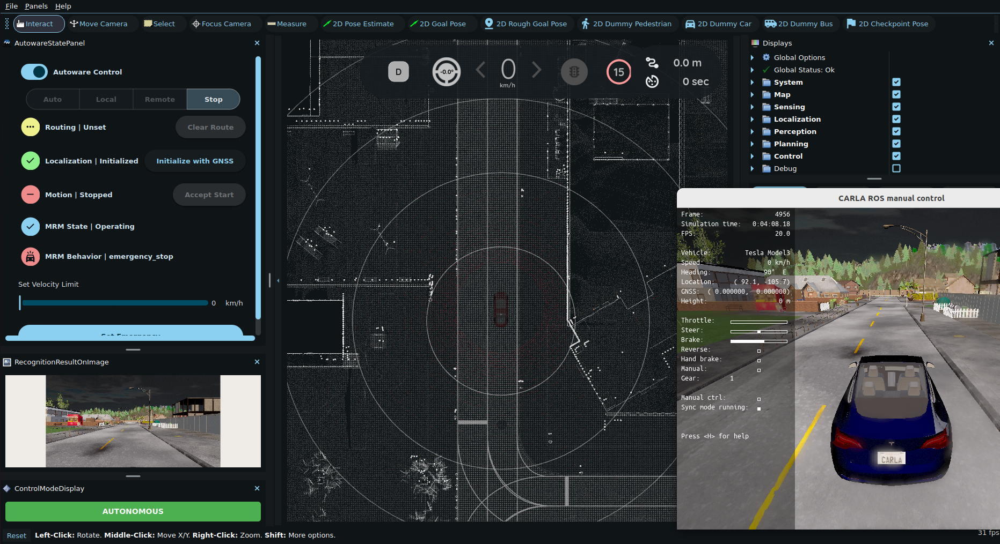

# autoware_carla_bridge

> [!WARNING]  
> This repo is under development mean that some features may not work as expected.


## Installation

1. Clone the repository into your ROS2 workspace src directory.

``` bash
cd ~/av_ws/src
git clone https://github.com/peeradonmoke2002/autoware_carla_bridge.git
```

and also clone the `carla_ros` package this is need my package due to have changes to make compatible with Autoware.

``` bash
git clone https://github.com/peeradonmoke2002/carla_ros.git
```


2. Install dependencies
```bash
sudo apt update && sudo apt upgrade
rosdep update
rosdep install -y --from-paths src --ignore-src --rosdistro $ROS_DISTRO
```
3. Build the workspace
``` bash
cd ~/av_ws
colcon build --symlink-install
```

## Usage
> [!IMPORTANT]
> Ensure you have installed the CARLA server.
> If not installed, follow the [CARLA installation guide](https://github.com/peeradonmoke2002/Carlar_install.git) at branch ue4.

1. Launch CARLA simulator on your machine or another machine.

``` bash
cd carla/
./CarlaUE4.sh -prefernvidia -quality-level=Low -RenderOffScreen
```
 
2. Launch `bring_up_carla.launch.py`

Before launching, you need to set the carla host ip and port to match your CARLA simulator settings. First go to file `bring_up_carla.launch.py` and change the default value of `host` and `port` and `town` that your want arguments if needed.

``` bash
cd launch
code bring_up_carla.launch.py
```
edit the default_value of `host`, `port` and `town` arguments if needed.

```python
    host = DeclareLaunchArgument(
        'host',
        default_value='localhost'
    )

    port = DeclareLaunchArgument(
        'port',
        default_value='2000',
        description='CARLA port'    
    )
    town = DeclareLaunchArgument(
        'town',
        default_value='Town01'
    )
    timeout = DeclareLaunchArgument(
        'timeout',
        default_value='10.0'
    )
```
Then launch the file using `ros2 launch` command.

``` bash
ros2 launch autoware_carla_bridge bring_up_carla.launch.py
```

3. Launch `autoware_carla_bridge.launch.py`

```bash
ros2 launch autoware_carla_bridge autoware_carla_bridge.launch.py
```

4. Launch Autoware Core 

``` bash
ros2 launch autoware_carla_bridge e2e_simulator.launch.xml
```

wait a few seconds to make sure all nodes are up and running. and done intitialization position of the vehicle in Autoware.


